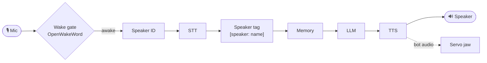

# Larry

[](https://github.com/jasonm4130/larry/actions/workflows/ci.yml)
[](LICENSE)
[](https://www.python.org/downloads/)
[](https://github.com/astral-sh/ruff)

A cursed Halloween skull living on your office desk. Raspberry Pi 5 inside, motorized jaw, cloud AI doing all the thinking. People talk to him. He talks back—sardonic, theatrical, and completely unhinged. No local inference, no ethical guardrails, just vibes and servo angles.

<!-- DEMO: drop a hero photo + a jaw-sync clip here — it's the single highest-leverage
     thing for a physical voice project. GitHub renders a drag-dropped MP4 inline, or:
     
     See docs/media/README.md for what to capture. -->

## What Is This

Larry is a conversational skull. He has a local wake word detector (listens for "Hey Larry" via OpenWakeWord — no account needed), understands speech via cloud Whisper, generates responses via a cloud LLM (xAI's Grok by default, Anthropic's Claude as a fallback), and runs them through text-to-speech with custom audio tags like `[cackle]` and `[whispers]`. A PCA9685 servo driver moves his jaw while he speaks. He remembers who you are after you enroll (10 seconds of voice), and his personality is entirely driven by a Markdown file you can edit to make him meaner, sillier, or more pretentious.

**TL;DR:** It's a toy for offices. Not practical. Extremely fun.

## Stack

| Component | Service/Library |
|-----------|-----------------|
| Orchestration | Pipecat |
| Wake word | OpenWakeWord (local, no key) |
| Speech-to-text | Groq Whisper-large-v3-turbo |
| LLM | Grok-4.20 via xAI direct (default) → Claude Sonnet 5 via OpenRouter (fallback) |
| Text-to-speech | ElevenLabs `eleven_flash_v2_5` (default; `eleven_v3` adds inline `[cackle]`-style tags, needs alpha access) |
| Memory | Mem0 (self-hosted) |
| Speaker ID | WeSpeaker CAM++ (ONNX) |
| Hardware | Raspberry Pi 5, MG90S servo, PCA9685, Jabra Speak 510 (USB mic+speaker, hardware AEC) |

## How It Works

A local wake gate guards a pipeline of cloud voice services; a tap on the synthesized audio drives the servo jaw in sync. Everything runs in one self-hosted Python process — and identically on a laptop with the hardware mocked.



See [`docs/ARCHITECTURE.md`](docs/ARCHITECTURE.md) for the full pipeline, per-turn walkthrough, and module map.

## Quick Start (macOS)

```bash
brew install portaudio          # one-time system dep for audio I/O
cp .env.example .env            # OpenRouter + Groq + ElevenLabs (+ optional XAI for the default LLM path)

uv sync
uv run larry enroll yourname    # record 10 seconds of your voice
uv run larry                    # start the skull
```

On macOS, hardware is mocked—jaw angles print to stdout. The experience is otherwise identical.

## On a Raspberry Pi

```bash
uv sync --extra pi

# Install the templated systemd unit (replace `jason` with your username):
sudo cp systemd/larry@.service /etc/systemd/system/
sudo systemctl daemon-reload
sudo systemctl enable --now larry@jason   # journalctl -u larry@jason -f
```

You'll need to wire up the PCA9685 to your Pi's I2C bus and point the servo to a real MG90S. See [`docs/RESEARCH_larry_stack.md`](docs/RESEARCH_larry_stack.md) for hardware detail.

## Personality

Larry's voice, tone, and character live in `src/larry/personality/larry.md`. Edit it to change how sardonic, verbose, or unhinged he is. The file is loaded at startup, so you can tweak vibe without redeploying.

## Cost

- **Recurring:** ~$7/month in cloud API calls (at typical office chatting volume)
- **One-time:** ~$170 in hardware (Pi, servo, driver board, mic, speaker)

## Development

```bash
uv sync                      # installs dev tools (ruff, pyright, pytest, pre-commit)
uv run pre-commit install    # lint + format on every commit
uv run ruff check && uv run pyright && uv run pytest
```

CI (GitHub Actions) runs the same gates on every push and PR.

## Status

Very early. Built for fun. Will probably eat your batteries and ask existential questions at 3 AM.

## More Reading

- [`docs/ARCHITECTURE.md`](docs/ARCHITECTURE.md) — pipeline, per-turn walkthrough, module map.
- [`docs/RESEARCH_larry_stack.md`](docs/RESEARCH_larry_stack.md) — the rationale behind every stack choice (why Groq over OpenAI's Whisper, why Resemblyzer for speaker ID, etc.), with dated notes where the shipped decision diverged.

## License

MIT — see [LICENSE](LICENSE).
