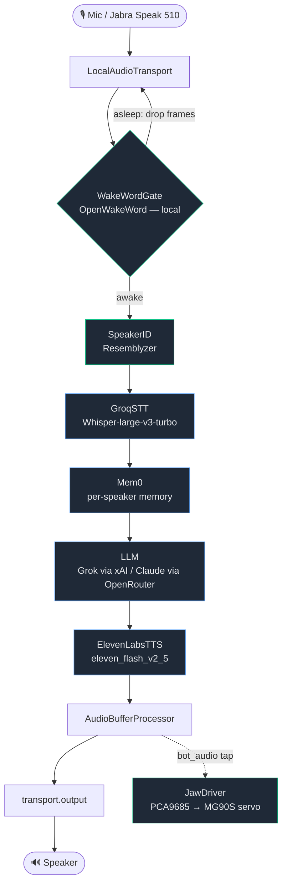

# Architecture

Larry is a single self-hosted Python process built on [Pipecat](https://github.com/pipecat-ai/pipecat). Audio comes in from a desk microphone, flows through a wake gate and a voice pipeline of cloud services, and comes back out as speech — while a tap on the synthesized audio drives a servo jaw in sync.

## The pipeline

Green-bordered stages run locally on the Pi; blue-bordered stages are cloud APIs. Nothing in the speech path requires local model inference.

## How a turn works

1. **Wake gate** — `WakeWordGate` (`src/larry/wake.py`) runs OpenWakeWord on every input frame. While asleep it drops audio so nothing downstream sees it; on hearing "Hey Larry" it opens the gate and starts a sleep timer that closes it again after a stretch of post-speech silence (`WAKE_SLEEP_TIMEOUT_S`).
2. **Speaker ID** — `SpeakerID` (`src/larry/speaker_id.py`) buffers ~1s of audio, computes an embedding via the configured `SpeakerEmbedder` (`src/larry/speaker_embedder.py`; Resemblyzer's 256-d GE2E vector today, `SPEAKER_EMBEDDER=resemblyzer`), and cosine-matches it against enrolled voices. Voiceprints are namespaced by embedder name and dim in the speakers DB, so a print is never matched across embedders — swapping the embedder means every speaker must re-enroll (CLI `larry enroll <name>` or the in-conversation `enroll_speaker` tool). The identified name becomes the Mem0 `user_id` for the turn.
3. **STT** — Groq Whisper-large-v3-turbo transcribes after end-of-turn. Turn-taking is gated by Silero VAD plus an optional Smart Turn v3 neural end-of-turn model (`ENABLE_SMART_TURN`).
4. **Memory** — Mem0 (self-hosted, local FastEmbed embeddings) injects per-speaker facts before the LLM and extracts new facts after.
5. **LLM** — Grok-4.20 direct via xAI when `XAI_API_KEY` is set (fast/cheap default), else Claude Sonnet 5 via OpenRouter. The character card (`src/larry/personality/larry.md`) is the system prompt.
6. **TTS** — ElevenLabs `eleven_flash_v2_5` synthesizes the reply (`eleven_v3` performs inline `[cackle]`/`[whispers]` tags but needs alpha access).
7. **Jaw sync** — an `AudioBufferProcessor` taps the **bot** audio track (`on_track_audio_data` → `bot_audio`) and feeds RMS levels to the `JawDriver`, which maps them to servo angles so the mouth moves with the voice.

## Module map

| Module | Responsibility |
|---|---|
| `__main__.py` | Entry point; loads config, builds and runs the pipeline |
| `config.py` | Environment → frozen `Config` dataclass (all tunables in one place) |
| `pipeline.py` | Assembles the Pipecat services and frame processors, runs the task |
| `wake.py` | `WakeWordGate` — OpenWakeWord wake/sleep gating |
| `speaker_id.py` | `SpeakerID` — voiceprint enrollment + per-turn identification |
| `speaker_embedder.py` | `SpeakerEmbedder` Protocol — swappable embedding model (Resemblyzer today) |
| `memory.py` | Mem0 wiring and the SQLite conversation log |
| `audio_filter.py` | WebRTC AEC3 echo cancellation (belt-and-braces vs the Jabra's hardware AEC) |
| `stt_mute_fix.py` | Mutes STT while Larry is speaking to avoid self-transcription |
| `jaw.py` | `JawDriver` Protocol + RMS-to-angle mapper |
| `hardware/jaw_mock.py` · `jaw_pca9685.py` | Mock (macOS) and real PCA9685 servo (Pi) backends |
| `personality/larry.md` | The character card — voice, tone, safety constraints, audio-tag allow-list |

## Hardware abstraction

The jaw is the only hardware Larry drives, and it sits behind a `JawDriver` Protocol (`src/larry/jaw.py`). `LARRY_HARDWARE` selects the backend — `mock` (default on macOS, logs angles to stdout) or `pca9685` (default on Linux/aarch64, drives a real servo over I²C). This is what lets the entire app — pipeline, tests, and all — run identically on a laptop with no hardware attached.

## Why this shape

The rationale behind each service choice (Pipecat, OpenWakeWord, Groq, the Grok/Claude split, ElevenLabs, Mem0, Resemblyzer, and the Pi hardware) is documented in [`RESEARCH_larry_stack.md`](RESEARCH_larry_stack.md), including dated notes where a shipped decision diverged from the original research.
